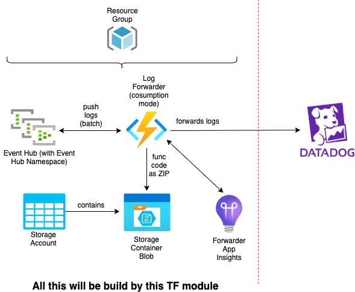

# azure-datadog-log-forwarder

Forwarding logs received from eventhub to datadog.

# Input variables to module
* __resource_location__: default is _West Europe_
* __project_name_as_resource_prefix__: project name as prefix for all created Azure Resources
* __eventhub_message_retention__: retention for log events within Event Hub. Default is 1 day
* __eventhub_partition_count__: partition count for Event Hub. Default is 4
* __subscription_id__: id of Azure Subscription, where all Azure Resources should be build
* __datadog_api_key__: target DD Api Key for forwarded logs
* __dd_tags__: custom datadog tags attached to logs additionally to tags _subscription_id_, _resource_group_ and _forwardername_

_Example of usage:_

```terraform
module "datadog_log_forwarder" {
  source                          = "git::https://github.com/edekadigital/terraform-azure-modules.git//terraform-azure-datadog-log-forwarder?ref=v0.1.0"
  subscription_id                 = "mySubscriptionId"
  project_name_as_resource_prefix = "myProject-dev"
  datadog_api_key                 = "XYZ"
  dd_tags                         = "stage:myStage,env:myEnv,team:myTeam"
}
```
# Output variables from module
* __eventhub_name__: name of the event hub
* __eventhub_authorization_rule_id__: id of Event Hub Namespace's Shared Access Policy

Both Event Hub Name and Rule Id are needed to configure Diagnostic Settings on Log Source Apps (f.e. Function Apps or Web Apps) to route proper logs from them to the Event Hub.

_Example of usage:_

```terraform
resource "azurerm_monitor_diagnostic_setting" "trigger_datadog" {
  depends_on = [module.datadog_log_forwarder]

  name                           = "datadog"
  target_resource_id             = azurerm_app_service.myApp.id
  eventhub_name                  = module.datadog_log_forwarder.eventhub_name
  eventhub_authorization_rule_id = module.datadog_log_forwarder.eventhub_authorization_rule_id

  log {
    category = "AppServiceLogs"
    enabled  = true
  }

  log {
    category = "AppServiceConsoleLogs"
    enabled  = true
  }

  metric {
    category = "AllMetrics"
    enabled  = false
  }
}
```

# Architecture



# Details of Azure Infrastructure

* __Event Hub__
    * SKU: _Basic_
    * Capacity: _1 Throughput Unit_
    * Default retention: _1 day_ (can be passed as module param)
    * Partition Count: _4_ (can be passed as module param)


* __Storage Account__
    * Tier: _Standard_
    * Replication Type: _LRS_


* __Log Forwarder Function App__
    * Tier: _Dynamic_ (consumption mode)
    * Plattform: _Linux_
    * Runtime: _Node.js v.12_
    * SAS for access app code from Storage Account valid from 2020-10-15 until 2030-10-15

# Remote / desired state

Terraform remote state for created Azure resources is not maintained inside of this Terraform module. This will be done by calling Terraform code.


# Origination

This module has been inspired by:

[datadog github repo](https://github.com/DataDog/datadog-serverless-functions/tree/master/azure/activity_logs_monitoring)

It is not necessary to manually sync the triggers after deployment to get the EventHub trigger running. This will be done by this Terraform module
automatically by using approach describer [here](https://ilhicas.com/2019/08/17/Terraform-local-exec-run-always.html).

For the root problem with syncing Azure Function triggers in case of running fuction from packaged source see [Microsoft Documentation 1](https://docs.microsoft.com/en-us/azure/azure-functions/run-functions-from-deployment-package#enabling-functions-to-run-from-a-package) and [Microsoft Documentation 2](https://docs.microsoft.com/en-us/azure/azure-functions/functions-deployment-technologies#trigger-syncing)
