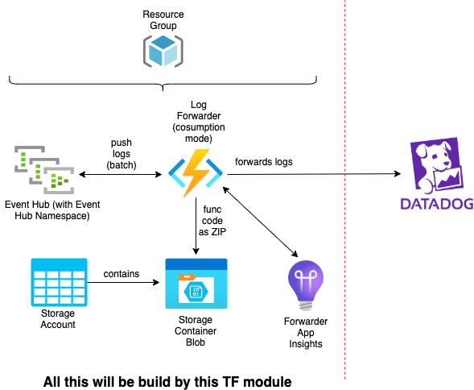

# azure-datadog-log-forwarder

Forwarding logs received from eventhub to datadog.

# Input variables to module
* __resource_location__: default is `West Europe`
* __project_name_as_resource_prefix__: project name as prefix for all created Azure Resources
* __existing_ressource_group__: already existing ressource group can be used, new ressource group will not be created
* __eventhub_message_retention__: retention for log events within Event Hub. Default is 1 day
* __eventhub_partition_count__: partition count for Event Hub. Defaults to 4
* __datadog_api_key__: target DD Api Key for forwarded logs
* __datadog_tags__: custom datadog tags attached to all logs additionally to tags `subscription_id`, `resource_group` and `forwardername`. Also used to tag Log Forwarder's datadog monitors, if `datadog_create_monitors = true`. Defaults to an empty map `{}`.
* __datadog_tag_name_kind__: Tag name for the `kind` tag. Defaults to `kind`.
* __datadog_site__: datadog site like (US/EU). Default id `datadoghq.eu`
* __datadog_service_map__: a map translating azure service names into datadog `service` tags. Defaults to an empty map `{}`.
* __datadog_create_dashboard__: create a datadog dashboard for log forwarder backbone Azure resources. Defaults to false.
* __datadog_create_monitors__: create datadog monitors for log forwarder backbone Azure resources. Defaults to false.
* __datadog_dashboard_default_env__: default env value shown in the dashboard. Defaults to `*`.
* __datadog_monitors_function_executions_time__: time span definition for function execution monitor. Defaults to `last_1h`.
* __datadog_monitors_function_executions_threshold__: threshold for minimal function executions. Defaults to `50`.
* __datadog_monitors_notification_channel__: Channel name for Log Forwarder observing datadog monitors notifications, f.E. MS Team Channel name. Mandatory only, if `datadog_create_dashboard` or `datadog_create_monitors` is `true`. Otherwise, will be ignored.
* __datadog_monitors_priority__: Priority of monitors in datadog. Defaults to `2`.
* __datadog_monitors_tags__: Additional tags to attach to monitors. Defaults to `{service = "log-forwarder"}`.  
* __azure_tags__: Tags to attach to all created Azure Resources for Log Forwarder. Defaults to empty map. If `datadog_create_dashboard = true`, at least `env` tag with value must be provided to match with pre-configured `env` filter in the dashboard.

_Example of usage:_

```terraform
provider "azurerm" {
  // ...
}

provider "datadog" {
  // ...
}

module "datadog_log_forwarder" {
  source                          = "git::https://github.com/edekadigital/terraform-azure-modules.git//terraform-azure-datadog-log-forwarder?ref=v0.1.0"
  project_name_as_resource_prefix = "myProject-dev"
  datadog_api_key                 = "XYZ"
  datadog_tags                    = { 
    stage = "myStage"
    env   = "myEnv"
    team  = "myTeam"
  }
  datadog_service_map             = {
    some-azure-service-name = "service-1"
    some-other-service-name = "service-2"
  }
  datadog_create_dashboard              = true
  datadog_create_monitors               = true
  datadog_monitors_notification_channel = "@teams-monitoring-proj"
  azure_tags                     = {
    env = "dev"
    team  = "myTeam"
  }
}
```
# Output variables from module
* __eventhub_name__: name of the event hub
* __eventhub_authorization_rule_id__: id of Event Hub Namespace's Shared Access Policy

Both Event Hub Name and Rule Id are needed to configure Diagnostic Settings on Log Source Apps (f.e. Function Apps or Web Apps) to route proper logs from them to the Event Hub.

_Example of usage:_

```terraform
resource "azurerm_monitor_diagnostic_setting" "trigger_datadog" {
  depends_on = [module.datadog_log_forwarder]

  name                           = "datadog"
  target_resource_id             = azurerm_app_service.myApp.id
  eventhub_name                  = module.datadog_log_forwarder.eventhub_name
  eventhub_authorization_rule_id = module.datadog_log_forwarder.eventhub_authorization_rule_id

  log {
    category = "AppServiceLogs"
    enabled  = true
  }

  log {
    category = "AppServiceConsoleLogs"
    enabled  = true
  }

  metric {
    category = "AllMetrics"
    enabled  = false
  }
}
```

# Architecture



# Details of Azure Infrastructure

* __Event Hub__
    * SKU: _Basic_
    * Capacity: _1 Throughput Unit_
    * Default retention: _1 day_ (can be passed as module param)
    * Partition Count: _4_ (can be passed as module param)


* __Storage Account__
    * Tier: _Standard_
    * Replication Type: _LRS_


* __Log Forwarder Function App__
    * Tier: _Dynamic_ (consumption mode)
    * Plattform: _Linux_
    * Runtime: _Node.js v.12_
    * SAS for access app code from Storage Account valid from 2020-10-15 until 2030-10-15

# Datadog Dashboard and Monitors for Log Forwarder's backbone Azure Infrastructure

To observe your Log Forwarder health and issues, you can optionally turn on datadog dashboard and monitors on per setting input variable `datadog_create_dashboard` and `datadog_create_monitors` to `true`.
In this case, you can provide Notification Channel (f.e. MS Teams Channel name) per input variable `datadog_monitors_notification_channel`.
You may want to deploy the dashboard only for one env/stage and monitors for all stages as the dashboard is providing information for all stages via drop down.

Datadog dashboard includes:

* Timeseries information about Event Hubs main metrics, like healthcheck, throttling, throughput, quota exceeded errors and user / server errors.
* Timeseries information about Forwarder Function main metrics, like 4xx and 5xx errors, average response time, count executions and cumulative execution units.
* Timeseries information about Blob Storage main metrics, like healthcheck, e2e-latency and throughput

Datadog monitors includes:
* __Event Hub monitors:__
  * Event Hub Errors
  * Event Hub Healthcheck
  * Event Hub Quota Exceeded
  * Event Hub Throttling
* __Forwarder Function monitors:__
  * Errors 
  * Executions
* __Storage Account monitor:__
  * Healthcheck

# Remote / desired state

Terraform remote state for created Azure resources is not maintained inside of this Terraform module. This will be done by calling Terraform code / project.


# Origination

This module has been inspired by:

[datadog github repo](https://github.com/DataDog/datadog-serverless-functions/tree/master/azure/activity_logs_monitoring)

It is not necessary to manually sync the trigger after deployment of new version of the Forwarder Function to get the EventHub trigger running. This will be done by this Terraform module
automatically by listing on changes HASH of function's ZIP archive content. So, resync will be triggered, if content of the archive changed.

For the root problem with syncing Azure Function triggers in case of running function from packaged source see [Microsoft Documentation 1](https://docs.microsoft.com/en-us/azure/azure-functions/run-functions-from-deployment-package#enabling-functions-to-run-from-a-package) and [Microsoft Documentation 2](https://docs.microsoft.com/en-us/azure/azure-functions/functions-deployment-technologies#trigger-syncing)
